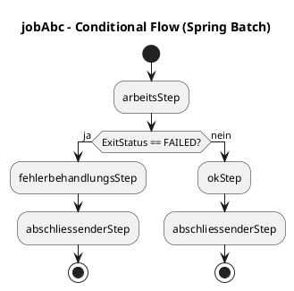
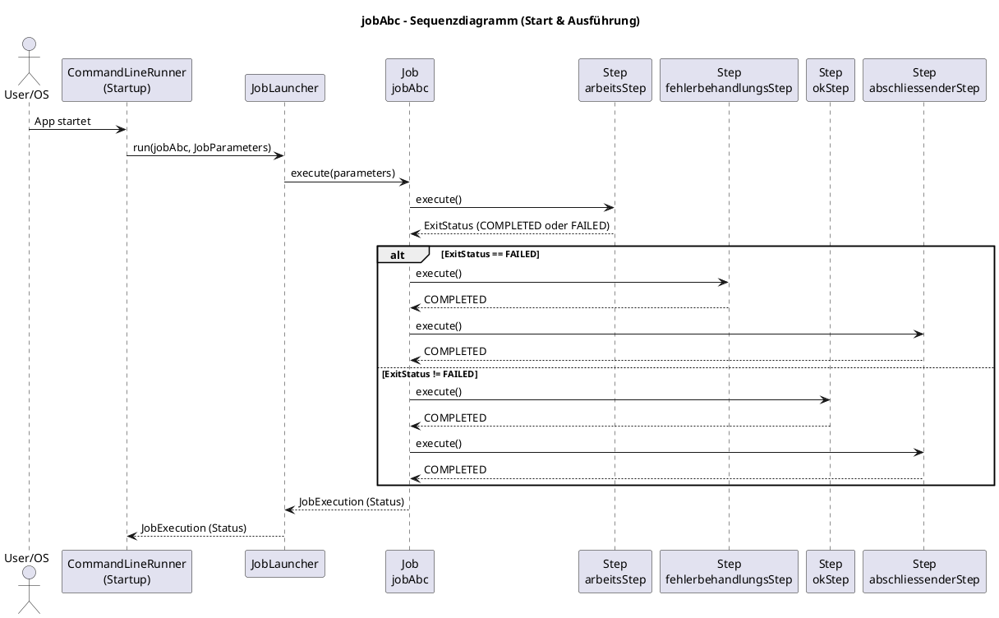
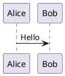
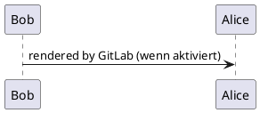
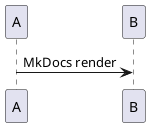
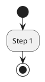

# Conditional Flow Job -- Erklärung der Implementierung

## Überblick

Diese Konfiguration implementiert einen **Spring Batch Job mit
Conditional Flow**. Der Job verzweigt abhängig vom ExitStatus eines
Steps in unterschiedliche Folge-Steps.

Der Job heißt:

    jobAbc

------------------------------------------------------------------------

# 1. Grundstruktur

Die Klasse ist eine klassische Spring-Konfigurationsklasse:

``` java
@Configuration
public class ConditionalFlowJobConfiguration {
```

In Spring Boot 3 ist `@EnableBatchProcessing` in der Regel **nicht mehr
erforderlich**, da die Autokonfiguration dies übernimmt.

------------------------------------------------------------------------

# 2. Konstante für Job-Parameter

``` java
public static final String OK_ODER_FEHLER = "OK_ODER_FEHLER";
```

Dieser Parameter steuert das Verhalten des Geschäfts-Tasklets:

-   `ok` → Step läuft erfolgreich durch
-   alles andere → Step erzeugt absichtlich einen Fehler
-   kein Parameter → Zufallsentscheidung

------------------------------------------------------------------------

# 3. Tasklet: PrintTextTasklet

``` java
public static class PrintTextTasklet implements Tasklet
```

Dieses Tasklet:

-   gibt lediglich Text auf der Konsole aus
-   beendet sich mit `RepeatStatus.FINISHED`

Es ist ein einfaches Utility-Tasklet zur Visualisierung der Ausführung.

------------------------------------------------------------------------

# 4. Tasklet: ArbeitsTasklet

``` java
public static class ArbeitsTasklet extends PrintTextTasklet
```

Dieses Tasklet simuliert einen Geschäftsprozess.

Ablauf:

1.  Liest die Job-Parameter aus dem StepContext
2.  Prüft den Parameter `OK_ODER_FEHLER`
3.  Wenn Wert ≠ "ok" → Exception wird geworfen
4.  Wenn Wert = "ok" → Step beendet sich erfolgreich

Der Fehler ist bewusst gewollt:

``` java
throw new Exception("-- Dieser Fehler ist korrekt! --");
```

Dadurch erhält der Step den ExitStatus `FAILED`.

------------------------------------------------------------------------

# 5. Definition der Steps

## arbeitsStep

Der zentrale Step des Jobs.

``` java
@Bean
public Step arbeitsStep(...)
```

Enthält das `ArbeitsTasklet`.

------------------------------------------------------------------------

## fehlerbehandlungsStep

Wird ausgeführt, wenn `arbeitsStep` fehlschlägt.

------------------------------------------------------------------------

## okStep

Wird ausgeführt, wenn `arbeitsStep` erfolgreich war.

------------------------------------------------------------------------

## abschliessenderStep

Wird in beiden Fällen ausgeführt (Success oder Failure).

------------------------------------------------------------------------

# 6. Job-Definition mit Conditional Flow

``` java
@Bean
public Job meinConditionalFlowJobAbc(...)
```

Wichtige Teile:

## RunIdIncrementer

``` java
.incrementer(new RunIdIncrementer())
```

Sorgt dafür, dass jede Job-Ausführung eine neue JobInstance erhält.

------------------------------------------------------------------------

## Conditional Flow

``` java
.flow(arbeitsStep)
    .on(ExitStatus.FAILED.getExitCode()).to(fehlerbehandlungsStep)
    .next(abschliessenderStep)
.from(arbeitsStep)
    .on("*").to(okStep)
    .next(abschliessenderStep)
.end()
```

### Bedeutung:

1.  Starte mit `arbeitsStep`
2.  Wenn ExitStatus = FAILED → gehe zu `fehlerbehandlungsStep`
3.  Danach → `abschliessenderStep`
4.  Wenn ExitStatus ≠ FAILED → gehe zu `okStep`
5.  Danach → `abschliessenderStep`

------------------------------------------------------------------------

# 7. Ablaufdiagramm (logisch)

## Erfolgsfall

    arbeitsStep (ok)
       ↓
    okStep
       ↓
    abschliessenderStep

## Fehlerfall

    arbeitsStep (FAILED)
       ↓
    fehlerbehandlungsStep
       ↓
    abschliessenderStep

------------------------------------------------------------------------

# 8. Technische Besonderheiten

-   Der Job nutzt das **Flow-API von Spring Batch 5**
-   Keine lineare Step-Kette
-   Steuerung rein über ExitStatus
-   Fehler werden bewusst durch Exception ausgelöst
-   Der Job ist deterministisch steuerbar über Job-Parameter

------------------------------------------------------------------------

# 9. Beispielaufrufe

## Erfolgsfall

    --okOderFehler=ok

## Fehlerfall

    --okOderFehler=fehler

## Zufall

kein Parameter setzen

------------------------------------------------------------------------

# 10. Fazit

Diese Implementierung demonstriert:

-   Conditional Flow
-   ExitStatus-basierte Verzweigung
-   Tasklet-basierte Steps
-   Nutzung von JobParameters
-   Verwendung des RunIdIncrementer

Sie ist eine saubere Basis für komplexere Workflow-Szenarien in Spring
Batch.
---

## PlantUML-Diagramme

> Hinweis: Die folgenden Diagramme sind in **PlantUML** geschrieben.  
> In IntelliJ kannst du sie z.B. mit dem *PlantUML Integration*-Plugin direkt rendern, oder du nutzt einen PlantUML-Server bzw. die CLI.

### 1) Ablauf-/Flow-Diagramm (Conditional Flow)

Dieses Diagramm visualisiert genau die Logik aus `meinConditionalFlowJobAbc(...)`:

- Start mit `arbeitsStep`
- Bei `FAILED` → `fehlerbehandlungsStep` → `abschliessenderStep`
- Sonst (`*`) → `okStep` → `abschliessenderStep`



### 2) Sequenzdiagramm (JobStart → Step-Ausführung → Branching)

Das Sequenzdiagramm zeigt das Zusammenspiel der wichtigsten Beteiligten beim Start über einen `CommandLineRunner`:

- `CommandLineRunner` startet das Job-Launching
- `JobLauncher` startet den Job `jobAbc`
- Spring Batch führt den `arbeitsStep` aus
- Je nach Ergebnis verzweigt der Job in den passenden Step
- Am Ende läuft immer der `abschliessenderStep`



---

## Optional: PlantUML im Markdown automatisch rendern (IntelliJ / GitLab / MkDocs)

Du hast in diesem Dokument PlantUML-Blöcke in Code-Fences (```plantuml … ```). Viele Tools können das **direkt** oder mit **kleiner Konfiguration** automatisch rendern.

### 1) IntelliJ IDEA (empfohlen, lokal)
**So geht’s:**
1. Plugin **PlantUML integration** installieren (Settings → Plugins).
2. Optional: **Graphviz** installieren (für manche Layouts).
    - Windows: z.B. via Chocolatey `choco install graphviz` oder Installer.
3. Danach werden Blöcke wie unten im Editor/Preview gerendert:



### 2) GitLab (README.md / Wiki)
GitLab unterstützt „diagrams“ je nach Version/Setup. In vielen Installationen funktionieren Code-Fences wie:



Falls PlantUML in eurer GitLab-Instanz **nicht** gerendert wird, sind häufig 2 Wege üblich:
- **PlantUML-Diagramme aktivieren** (Admin/Instance-Setting, falls vorhanden)
- oder **Kroki** als Diagramm-Renderer verwenden (GitLab kann Kroki integrieren, abhängig von eurer Version/Policy)

> Hinweis: Da GitLab-Konfigurationen je nach Firma/Version stark variieren, ist das „funktioniert out-of-the-box“ leider nicht garantiert.

### 3) MkDocs (z.B. mkdocs-material) – mit Plugin
Für MkDocs ist der verbreitetste Weg ein Plugin, das PlantUML-Code-Fences rendert.

#### Variante A: `plantuml-markdown`
1) Plugin installieren:
```bash
pip install plantuml-markdown
```

2) In `mkdocs.yml` aktivieren (Beispiel):
```yaml
markdown_extensions:
  - plantuml_markdown:
      server: http://www.plantuml.com/plantuml
plugins:
  - search
```

Dann funktionieren Code-Fences wie:


#### Variante B: `pymdown-extensions` + `pymdownx.superfences` (häufig in mkdocs-material)
Je nach Setup kann man PlantUML-Fences über SuperFences routen. Das ist etwas „Tooling-lastig“ und variiert stark – wenn du mir sagst, ob du **mkdocs-material** nutzt und wie dein `mkdocs.yml` aussieht, kann ich dir eine passende, konkrete Konfig liefern.

### Best Practice für maximale Kompatibilität
- Nutze **immer** vollständige PlantUML-Blöcke mit `@startuml` / `@enduml`.
- Verwende **Code-Fences mit `plantuml`** (oder alternativ `puml`), z.B.:



